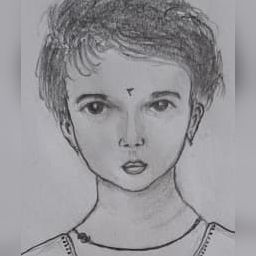
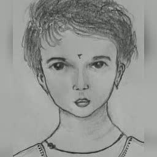

**Motion Transfer with UNet**

This project performs realistic face motion transfer using:

A UNet-based generator trained on keypoint heatmaps compared with 

A Stable Diffusion 2 Inpainting refiner that enhances expression regions (eyes + mouth) for smooth blinking and smiling.

The system preserves the original sketch applying motion only to key facial features for natural results.

**Install dependencies:**

pip install torch torchvision torchaudio

## 🌟 Demo Preview

| 🎨 Input | 🎥 Motion transfer Output |
|----------|--------------------|
|  |  |

